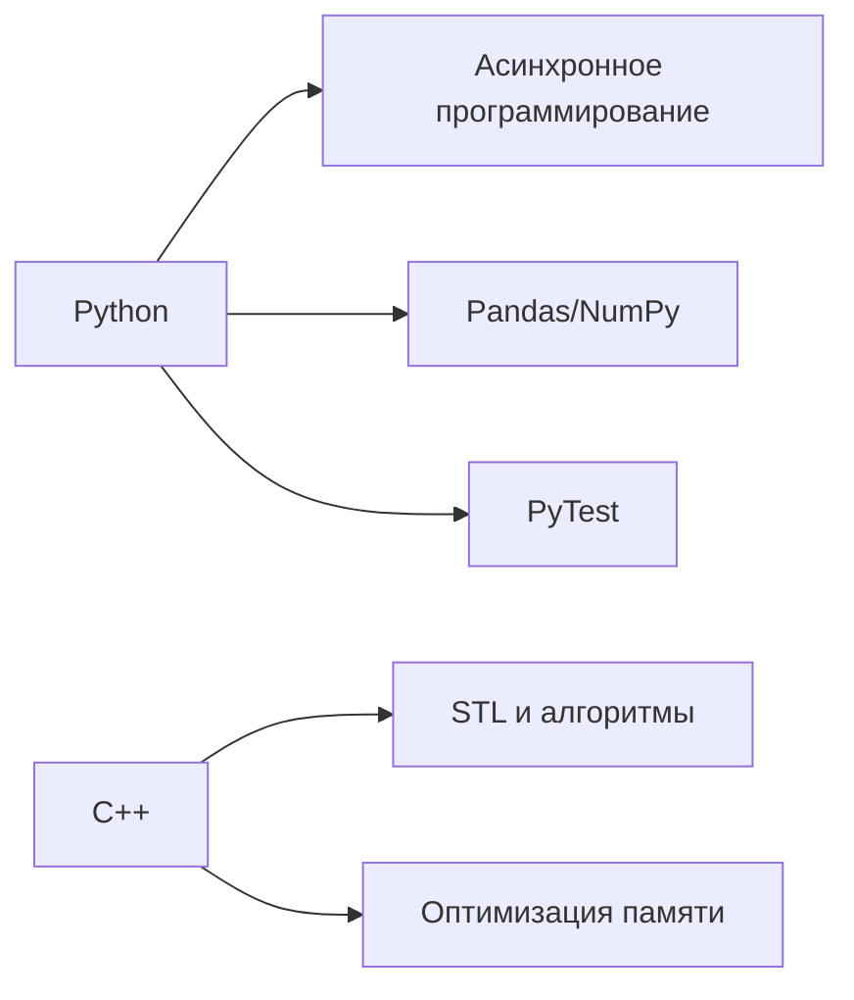

<h1 align="center">👋 ¡Hola, soy Lewis!</h1>
<h3 align="center">Python Developer | Backend | Telegram Bots | FastAPI</h3>

  
  

---

### 🛠️ Мой стек
**Языки:**  

**Фреймворки:**  

**Базы данных:**  

**Инструменты:**  

---

### 🚀 Мои проекты
1. **[Проект на FastAPI](https://github.com/Lewis-star-alt/user-generate)** - генератор случайных пользователей
2. **[Telegram бот](https://github.com/Lewis-star-alt/Bot)** - Бот и все
3. **[C++ утилита](https://github.com/Lewis-star-alt/glowing-computing-machine)** - Класс мат. матрицы чисто для тренировки

---

### 📚 Изучаю сейчас

---

### 📈 GitHub статистика

  
  

  

---

### 💡 Последние достижения
