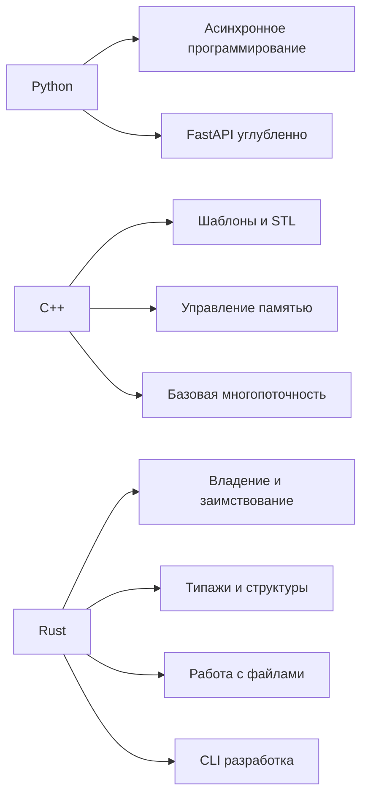
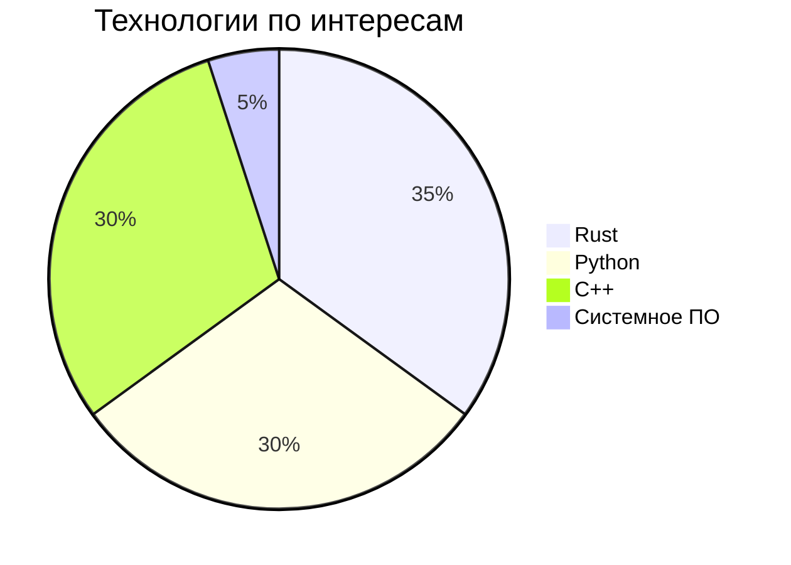

<h1 align="center">👋 ¡Hola, soy Lewis!</h1>
<h3 align="center">Software Engineer | Backend | System Programming | Embedded | Telegram Bots</h3>

<p align="center">
  <a href="https://t.me/Lewisstaralt">
    
  </a>
  <a href="kokirill70@gmail.com">
    
  </a>
  <a href="https://vk.com/kirill_kot100">
    
  </a>
</p>

---

### 🛠️ Мой стек
**Языки:**  


**Направления разработки:**  


**Фреймворки:**  


**Базы данных:**  


**Инструменты:**  


---

### 🎯 Активные проекты

**🦀 cipher** - Мощная утилита для шифрования подстановочными шифрами  
 

**🐍 FastAPI User Generator** - Генератор случайных пользователей  
 

**🤖 Telegram Bot** - Многофункциональный бот  
 

---

### 🚀 Мои проекты
1. **[cipher](https://github.com/Lewis-star-alt/cipher)** - Утилита для шифрования на Rust с поддержкой файлов
2. **[FastAPI User Generator](https://github.com/Lewis-star-alt/user-generate)** - генератор случайных пользователей
3. **[Telegram бот](https://github.com/Lewis-star-alt/Bot)** - Многофункциональный бот
4. **[C++ Matrix](https://github.com/Lewis-star-alt/glowing-computing-machine)** - Класс математической матрицы
5. **[Rust ASCII Art](https://github.com/Lewis-star-alt/rust-ascii)** - Генератор ASCII-арта на Rust

---

### 🔥 В фокусе сейчас


### 🦀 **Rust Development**
```rust
// Создаю эффективные CLI утилиты
fn main() {
    println!("🚀 Активно развиваю экосистему Rust!");
}
```

**Текущие проекты:**
- **cipher v1.1** - Добавление новых алгоритмов шифрования
- **Новый CLI проект** - Утилита для работы с файлами
- **Изучение** - Владение, типажи, обработка ошибок

### 🐍 **Python Backend**
```python
# Развиваю бэкенд направления
class CurrentFocus:
    def __init__(self):
        self.projects = ["FastAPI", "Telegram Bots", "Async"]
```

**Активные задачи:**
- **FastAPI улучшения** - Тесты и документация
- **Telegram Bot** - Новые функции и сценарии
- **Базы данных** - Оптимизация и моделирование


---

### 📚 Изучаю сейчас




---

### 📊 Моя активность


---

### 📈 GitHub статистика
<p align="center">
  
  
</p>

<p align="center">
  
</p>

---

### 🎵 Любимые технологии



---

<p align="center">
  
  <a href="https://github.com/Lewis-star-alt?tab=followers">
    
  </a>
</p>

<p align="center">
  <i>🚀 "От идеи к работающему коду — один коммит"</i>
</p>
```
