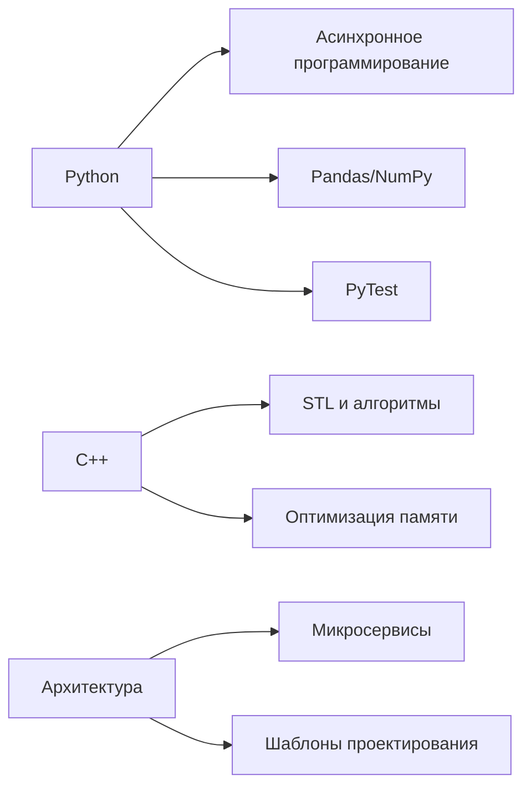

<h1 align="center">👋 Привет, я [Ваше Имя]!</h1>
<h3 align="center">Python Developer | Backend | Telegram Bots | FastAPI</h3>

  
  

---

### 🛠️ Мой стек технологий
### 🛠️ Мой стек
**Языки:**  

**Фреймворки:**  

**Базы данных:**  

**Инструменты:**  

---

### 🚀 Мои проекты
1. **[Проект на FastAPI](ссылка)** - Описание проекта (например: High-load API для сервиса аналитики)
2. **[Telegram бот](ссылка)** - Описание бота (например: Продвинутый бот для автоматизации с платежами)
3. **[C++ утилита](ссылка)** - Описание проекта (например: Высокопроизводительный парсер данных)

---

### 📚 Изучаю сейчас
- Повышение эффективности C++ кода
- Продвинутые паттерны проектирования
- Асинхронное программирование в Python
- Микросервисная архитектура
- Библиотеки для анализа данных: Pandas, NumPy

---

### 📈 GitHub статистика

  
  

  

---

### 💡 Последние достижения
- [ ] Завершил курс по продвинутому C++
- [ ] Разработал микросервисную архитектуру для проекта X
- [ ] Оптимизировал бота, обрабатывающего 10k+ запросов/час